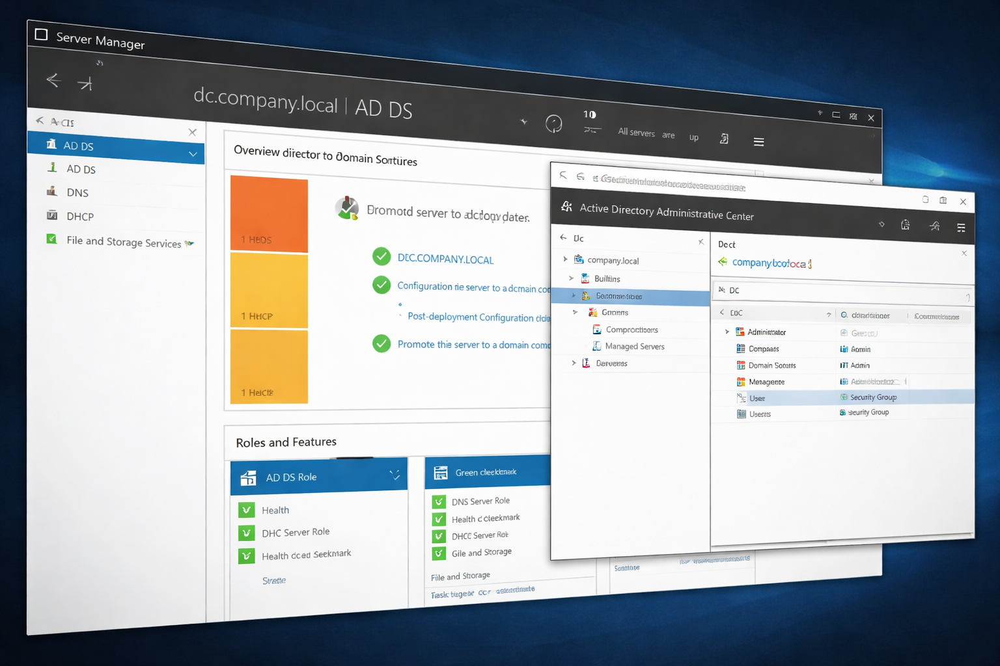

<p align="center">
  
</p>
# Home Lab Active Directory

A portfolio project documenting a Windows Server home lab built to practice **Active Directory**, **Group Policy**, **file sharing**, and **basic Linux integration** in a virtualized environment.

## Project Overview

This lab was built to simulate a small business domain environment using a Windows Server domain controller, Windows 10 client machines, and Ubuntu Linux. The goal was to understand how identity, access, policies, and shared resources are managed in a centralized network.

## Lab Design Approach

To make the environment more realistic and easier to manage, I modeled users after familiar people in my home environment and assigned each one a business role within the lab. This helped simulate a small company structure with department-based access, role-based permissions, and user-specific policy behavior while keeping the setup memorable and practical to administer.

## Objectives

- Build and configure a domain controller
- Create users, departments, and organizational units
- Apply Group Policy restrictions to standard users
- Configure shared folders and mapped drives
- Explore Linux integration in a Windows-based environment
- Practice documenting technical work clearly for a portfolio

## Lab Environment

| Component | Details |
|---|---|
| Hypervisor | VirtualBox |
| Server OS | Windows Server 2019 |
| Client OS | Windows 10 |
| Linux OS | Ubuntu |
| Scripting | Bash |
| Domain | `remmy.local` |
| Domain Controller | `DC01` |

## What Was Implemented

- **Active Directory Domain Services (AD DS)** on `DC01`
- **Department-based structure** using users, groups, and OUs
- **Group Policy restrictions** for standard users
- **Shared folder access** for domain users
- **Basic Linux presence** in the lab environment
- **Introductory scripting/log monitoring work**

## Repository Structure

```text
homelab-active-directory/
├── active-directory/
│   ├── setup.md
│   └── departments.md
├── file-server/
│   └── shared-folder.md
├── group-policy/
│   └── lockdown-policy.md
├── linux/
└── scripts/
```

## Documentation Map

- [`active-directory/setup.md`](./active-directory/setup.md) — Domain controller installation and AD DS setup
- [`active-directory/departments.md`](./active-directory/departments.md) — Department structure, users, groups, and access control
- [`file-server/shared-folder.md`](./file-server/shared-folder.md) — Shared folder setup and permissions
- [`group-policy/lockdown-policy.md`](./group-policy/lockdown-policy.md) — User restriction policy using GPO

## Key Skills Demonstrated

- Windows Server administration
- Active Directory setup and management
- Organizational Units and security groups
- Role-based access control (RBAC)
- Group Policy configuration
- Share and NTFS permissions
- Domain-based resource access
- Technical documentation

## Highlights

### 1. Domain Controller Deployment
A Windows Server 2019 machine was promoted to a domain controller for the `remmy.local` forest. Static addressing and core AD DS configuration were completed to support domain services.

### 2. Department and Access Design
Users were grouped by department such as IT, HR, Finance, and Sales. Organizational Units and security groups were used to reflect a simple business structure and support access control.

### 3. File Sharing
A central shared folder was created and exposed to domain users. Both share permissions and NTFS permissions were configured and tested from a domain-joined Windows client.

### 4. Group Policy Restrictions
A lockdown policy was configured to prevent standard users from accessing Control Panel and PC Settings, demonstrating centralized endpoint control.

## Outcomes

By completing this lab, I gained hands-on practice with:

- Promoting a server to a domain controller
- Managing identity and access in Active Directory
- Applying policy-based restrictions to users
- Configuring secure shared resources
- Testing administrative changes from the client side

## Future Improvements

- Add screenshots of the lab setup and management consoles
- Expand Linux integration documentation
- Add PowerShell automation scripts
- Include a network diagram of the lab
- Document DNS, DHCP, and event log monitoring in more detail

## Skills Demonstrated

- Active Directory Domain Services (AD DS)
- DNS configuration and troubleshooting
- Windows Server administration
- Client domain joining and authentication
- File sharing and NTFS permissions
- Linux integration with Windows (CIFS/SMB)
- Network troubleshooting (DNS, connectivity issues)

## Lab Architecture

- DC01 (Windows Server 2019) – Domain Controller, DNS
- Windows 10 VM – Domain client
- Ubuntu Machine – Linux client integrated via SMB

## Challenges & Fixes

- DNS failure: Could ping IP but not hostname → fixed by correcting DNS settings
- Domain join failure: Caused by time mismatch → fixed by syncing system time
- Intermittent connectivity: Identified as VirtualBox bridged instability
- Linux share access: Resolved CIFS mount and permission issues

## Author

Created by **Remeldo Stone** as part of a personal homelab and IT skills development portfolio.
